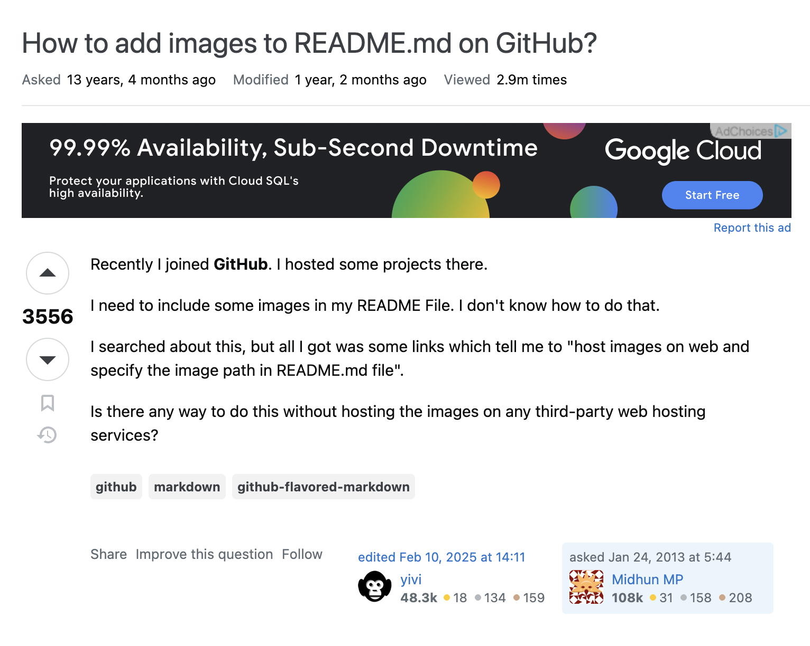

## What are Coding Standards?

some coding standards can actually help you learn a programming language. Do you agree?

After your first week of using ESLint with VSCode, what are your impressions? Are you finding that getting rid of all the ESLint errors is painful, or useful, or both, or something else entirely?

Write an interesting, informative essay on coding standards that addresses some or all of the above questions, or goes in a different direction entirely regarding coding standards. Make sure it provides your personal perspective and useful insights.


 *[How To Ask Questions The Smart Way](http://www.catb.org/esr/faqs/smart-questions.html)*

## A Reflection of my Experience

I actually installed VSCode on the first week of the course, mostly because I wanted to play around with it myself. Compared to other code editors I've tried in the past, I enjoyed VSCode's flexibility, in that it can manage working in multiple different programming languages




## An Example of a Not so Smart Question


```
console.log("code goes here");
```

## So What's the Takeaway

