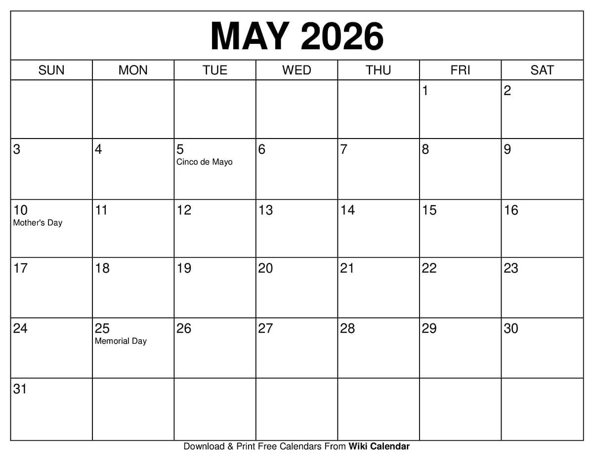

I'm not sure what's exactly going on for the Final Project, but I garnered that I'd best have an outline and proposal for what I'll likely do. 

# Agenda Planner

## Overview (including “The problem” and “The solution”)

* Problem
Imagine you wanted to organize your schedule for the week or month. You've got events you want planned, places to go, things to do, but there's so much to be done and you're overwhelmed. Or maybe you wanted to go somewhere nice, somewhere new. But first you have to do research, like locations, transportation, times, hotels, etc. Then you'd have to organize that research somewhere, a place that can be seen by whoever else is joining you, or easy to search through so that you can find what you're looking for. All of this can be very overwhelming to deal with.

* Solution
An Agenda Planner can be a very useful organizer to record any and all decisions concering events, places and times. Users can specify where they're doing, maybe get some suggestions thrown their way, then be able to simply alter their schedule as needed. Which includes having access to a calendar, set notifications, and get in touch with others to plan group events.

## Names of the proposers (to get credit for this assignment)

I am unsure of whether not we're allowed to collabrate on this Final Project, but I'd be welcome to anyone who would be able to assist, or assisting anyone who needs help.

## Mockup page ideas

Some simple concepts to implement:
* Landing Page
* User Profile
* Calendar Page
* Create New Event Page
* Search Page (for event ideas, though may not be needed)
* Gallery Page (for event idea images, like Pinterest, or to merely create a collections of images for past events)

The calendar page might look something like this, although I bit more interesting to look at, with color-coding options for events.

Think the notes app combinted with the calendar app, with the ability for collaboration like Google Docs.

I hope to be able to implement most if not all of these.

## Use case ideas

Event Planners (Users) will be able to log in or sign up, set up a new event, edit events, and add more people to join their event. Events can be set up within a calendar as a checklist with tasks, or as weekly, monthly, or yearly shindig to be mentioned on a calendar.
Event Planners are also notified if an event is upcoming, and keep track of which events have been completed or not.

Some potential uses:
* For students planning their school schdule, alongside their personal schedule and / or work schedule
* For teachers planning out their class agenda, alongside class times, due assignments or projects, and scheduled office hours.
* For anyone who are planning their vacations
* For large events or small events, get-togethers or anniversaries 

## Beyond the basics

Some more complicated features that would be nice to include:
* An interactive interface that allows Users to drag-and-drop events from place to place
* A text message interface that allows Users to communicate to each other within shared events
* The ability to customize Planner / Page Themes — implementing a Dark Mode option 
