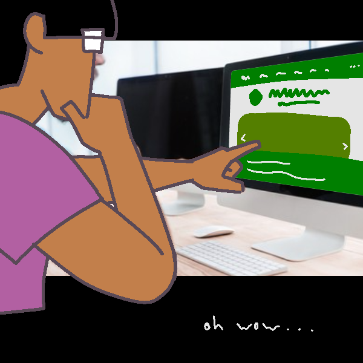
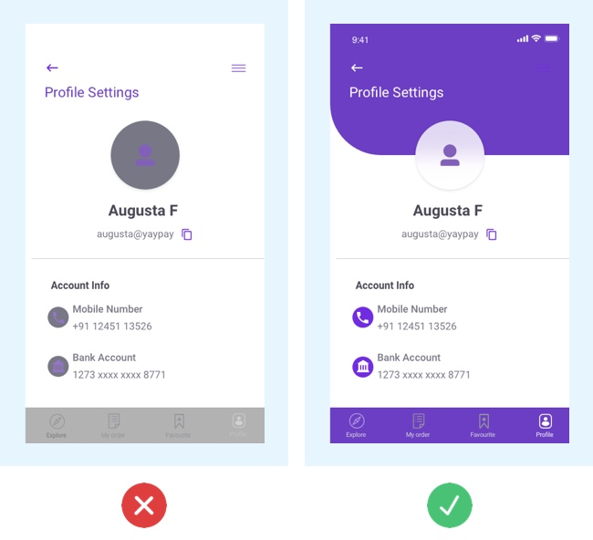
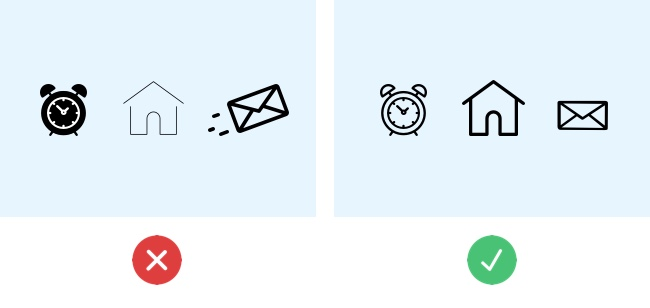

I didn't realize how complex and involved web development really is. You could write a few lines of code in HTML and maybe style it in CSS, and voila — you've got a decent looking page. But then it also looks flat, and unpolished. A user interface is the bridge between users and the digital code they engage with, which makes UI design an important aspect. 

As stated by *[A Quick Guide to UI Design Fundamentals](https://blush.design/blog/post/guide-ui-design)*, UI Design focuses on creating an interface that's easy to use and delightful. It isn't just making a UI that works well, but look good too. Whether it be ensuring links work and direct you to where you need to go, or making interactive interfaces funky and fun to use. Which is the point of using UI Frameworks, as it can assist in elevating the look of a UI by implementing a collection of pre-built, reusable components and design systems, as stated in *[What Are UI Frameworks — And Why Should You Use One?](https://medium.com/@vishal.p_95435/what-are-ui-frameworks-and-why-should-you-use-one-014028f99c69)*. Frameworks like React and Bootstrap's ready-made reusability can make web development faster and cost effective, without having to manually code and test each motif and layout. Not only will your UI look good, but you can also rely on established Frameworks to be well documented and have large communities to socialize and learn from.

<hr>

## UI Design and Art

In order to make a visually pleasing UI, I recommend making use of the Principle and Element of Art. These artistic fundamentals can be helpful, being used as guidelines to follow when creating an attractive UI. There's several articles that can be read, such as *7 Rules for Creating Gorgeous UI*, [Part 1](https://medium.com/@erikdkennedy/7-rules-for-creating-gorgeous-ui-part-1-559d4e805cda) and [Part 2](https://medium.com/@erikdkennedy/7-rules-for-creating-gorgeous-ui-part-2-430de537ba96) and *[10 Common UI Design Mistakes (and How to Avoid Them)](https://careerfoundry.com/en/blog/ui-design/common-ui-design-mistakes/)*, that give good pointers for how to make UI Design look good. 

For example, lets consider the some elements of art that may elevate the look of a UI. Color can be used to represent certain aspects — red for urgency or cancelletion, or black for emphasis, especially against a white background. Below is Bootstrap's predefined button styles for various purposes — the *btn-warning* identifier makes your button a bright yellow with black text, reminiscent of a warning sign. Then there's blue for *btn-primary*, red for *btn-danger* and green for *btn-success*. Each button color can be used for different intentions, or you could style the color for a specific hex color to reflect the color scheme of the website itself.

```html
<!--- Button Styles --->
<button type="button" class="btn btn-primary">Primary</button>
<button type="button" class="btn btn-secondary">Secondary</button>
<button type="button" class="btn btn-success">Success</button>
<button type="button" class="btn btn-danger">Danger</button>
<button type="button" class="btn btn-warning">Warning</button>
<button type="button" class="btn btn-info">Info</button>
<button type="button" class="btn btn-light">Light</button>
<button type="button" class="btn btn-dark">Dark</button>
<button type="button" class="btn btn-link">Link</button>

<!--- Specific Button Style --->
<button style="background-color: #800080; color: white;">Purple Button</button>
```

Below is another example of how color can be used for grouping parts together or give signifigance to certain aspects. You can see how a bold purple color stands out against the white background and "bubbles" separate sections from each other. The example on the left is fine, but the example on the right is much better because it makes the iconography and text more prominent.



Unity is also an important principle of art to consider when designing a UI, like making the sizes of icons or fonts similar. Repetition and continuity also makes for a good unified layout — below, the examples have similar icons, but the one on the left looks disorganized and out of place, while the one on the right is more orderly. Between the two examples, one is more pleasing to look at and one a user is more likely to appreciate using.



There's also simple, but important styles to follow, like paying attention to the eye-flow of a user when implementing navigation or side bars, or balancing the positive and negative space of section of text and images from each other. Which may seem obvious, but from a coding standpoint, it's always important to consider the user's experience and how you can improve it.

<hr>

## Working with Bootstrap 5

During this module on UI Design, I found UI Design to be a much more interesting experience than just working with HTML and CSS without frameworks. 

For example, I've recreated the official [UH Manoa website](https://manoa.hawaii.edu/) using Bootstrap 5, as shown below...


* *The Original Website...*


* *...And My Recreation*


The first heading navigation bar was the first to be made, which is one of the more familiar components of a website layout that I've learned this module. The secondary navigation bar was the second, as I assumed it to be formatted similar to the first, as only a few lines had to be changes. However, the original website utilized an image carousel — which is an interactive revolving display of images — and I had no experience with making one. Fortunately, the Bootstrap site had documentation for making one, which I then giddily took advantage of for my recreation. Everything else like the UH Manoa logo and the footer was much more simpler to configure. 

There are, however, certain aspects that aren't so similar; such as the fact that Bootstrap doesn't have a pre-made Flickr icon to use, or the fact that my recreated search bar is a tad bigger than the original's. The first couldn't be helped — I just used a 2-dot die as a substitute, while for the other, the fault lies in me. I wasn't quite sure how to change the size properly, so I left it as is. Though if you didn't see the original, you'd probably think it was fine. The images for the carousel however, I learned how to add that slight dark fade to the bottom, but I wasn't quite sure how to "zoom in" on the images just like the original. This just goes to show how complex it is to design an interesting-looking UI with Frameworks.

## UI Design is so fun and so complicated

I've never used Bootstrap or any kind of frameworks before this course. The closest I've gotten to web design is using Google Sites, and even then the experience is different in many ways. Altering the size of sections or the weight of fonts is one thing, but having unrestricted access to the code itself to modify however I like is another. But I really enjoyed working on UI design, or just in HTML in general. I'm an artistic and visual person at heart, so this has been a very informative and fascinating experience. 


