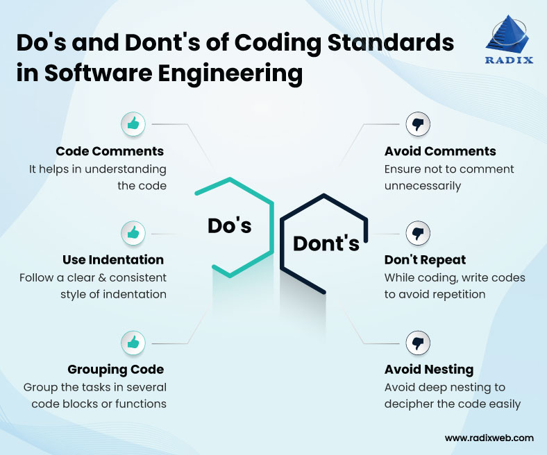

Intelligibility is an important concept in every language; the ability to be understood can assist greatly in communicating thoughts or ideas with others, especially when in a group or collaboration. And sometimes, we can't always be understood right away — things could be lost in translation, or more commonly, misunderstood due to lack of clarity. When text is written, we can rely on grammar checkers or beta readers to help review our words to tell us how we can improve. A like any other language, the same principle can be applied to programming languages, which is where coding standard prove useful.

## Coding Standards? What's that?

When I write my code, I usually understand and know how to make it readable for other. But most of the time I make it more convenient for me to understand than it is for others. Which makes coding standard helpful; they are guidelines that can be followed to govern the syntax of your code in order to better the quality — they assist in formatting your code to make it more uniform and readable. Enforcing coding standard, like having a grammar checker, indicates the need of a tool that can be implemented to help facilitate these useful guidelines. For example, having analytical tools like **ESLint** can help potential bugs like declared but unutilized variables and imports, or enforcing spacing for comprehensibility.

## Reading my Code from a Different Perspective


While I worked on assignments where I utilized **ESLint**, I think I've learned a bit more about myself and about coding as well. Personally, I tend to give a lot of space between my lines of code. I used to think it made the code easier to read, but I realize now it's either terrible redundant or inconvenient. Having **ESLint** was really helpful in pointing out whenever I made a useless variable or created an error without even knowing I did. I also tended to make long and numerous comments all over my code, sometimes in every line. Again, I had mistaken this for clarity, but in truth it only made my code more difficult to read, and by extension more difficult to understand. While writing comments isn't something **ESLint** directly enforces, it is a coding standard that I myself have been enforcing to the benefit of future readers. 

* *This is a simple example, but for bigger function, it gets tiring...*
```
/*
This function takes two numbers and adds them together, returning a sum
*/
function getSum(a: number, b: number): number {
  let sum: number = 0; // Return variable defined
  sum = a + b; // Adding the two given numbers
  return sum; // Returning the sum of the numbers
}
```

* *This is much better...*
```
// Returns a sum of two given numbers
function getSum(a: number, b: number): number {
  let sum: number = 0;
  sum = a + b;
  return sum;
}
```

It also helps to make the names of functions or variables more descriptive and unique, especially if you use similar names over and over again.

However, when it came to indentations, I'd have to disagree with how **ESLint** enforces it — while it prefers normal spaces, I have always preferred using tab spaces. It is much more convenient to type out, but I also understand that tab spaces may or may not vary different based off of code editors or applications. So for now, I will abide by **ESLint**'s indentation style.

## Some Other Points to Take Away

I've recently read this article, *[Understanding the Importance of Code Quality and Coding Standards](https://radixweb.com/blog/code-quality-and-coding-standard-in-software-development)*, which has helpful key points about how useful having quality code is for programmers. For instance, having easy-to-read code can increase efficiency, cutting down time programmers spend on debugging or maintaining and increasing time they could spend enhancing said code. And personally I agree — If I'm working on a big project, especially one I enjoy, I think I'd rather take the time to add more features or new aspects to my code than busy myself with working out bugs or figuring out how errors keep appearing. 

Below is a simple infographic from this article that highlights some decent principle that I've been following to help organize my code:



As I've said before, writing comments can either enhance or diminish the readability of your code. Being able make proper comments can summarize lengthy blocks of code or direct a programmer to specific and important lines. Alongside having naming schemes that serve to be direct or helpful. I used to find reading code to be a difficult task — all those lines of characters and letters and symbols, all condensed together to point of intertwining into a coding mess — so it can help to have convenient naming systems to help differentiate between the chaos, like having styling conventions like **camelCase** and **PascalCase** to differentiate between classes and variables.

In conclusion, it best to have coding standard to adhere to, as they can assist in making your coding experience much more legible and tolerable. Or at the very least, they help in making you *feel* like your code is more legible and tolerable.
