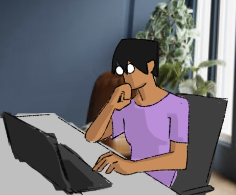

When I was in high school, I aspired to be some kinda of artist. A vauge conclusion to my student career, as I had always adored art as a activity and as an expression of the human soul, but not much else. I think I was just grasping for straws, determining my future based off of pencil sketches and hasty collages. But in my senior year, I took a computer science class and enjoyed it, maybe more than I enjoyed art.  

## Programming is it's own Art Form

I also aspired to learn how to code, but I always thought that was an even more vauge conclusion, unattainable at my meagre level. But when I actually tried to code, the previously impossible turned out to be possible. Art is but a form a creation, and so is programming, so you can by extension consider code to be a form of art — if's that's not much of a stretch. After all, there are graphic and web designers, creating tasteful layouts for people to interact with. Or game designers and digital animators who constantly push the boundaries of what they can show in terms of visual effect, computer graphics, or rendering. Not that I would personally know anything about that, but it's interesting nonetheless.

## Try Something New

Now I'm a Computer Science major in UH Manoa. That high school class was a spark of inspiration that'll either end in a wildfire disaster or an appreciated warmth. I'm optimistic enough to think it'll be the latter. I suppose that's why taking this major; deciding between your hobbies or success is hard but this way I can be pleased with doing a little bit of both. On one hand I can focus of developing my computational skills and on the other I do a bit of graphic design on my off time. I'm actually considering taking the Creative Computational Media Certificate Program next year, but plans like these are still up in the air. Hopefully by the time I've graduated, I'd have learned alot about programming and graphic design, to the point of blending my two favorite studies together into a fufilling resolution. Perhaps I'll revive my love for game design, like an auspicious monkey's paw.
