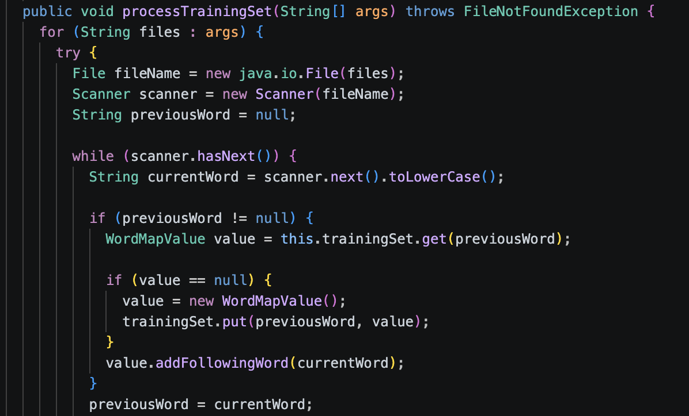

This is an assignment from ICS 211 that I worked on utilizing Java — it's a language model that randomly generates sentences based off of their frequency in given text files. Though this code isn't interactive, users can input whichever text file they wish the program to read from to the same folder, and have the program read from said text files and generate whichever kinda of sentences. 

FollowingWord.java includs a container class that holds the frequency of certain words, and WorkMapValue.java manages the context of those words and which words have paired up before. Combing them with TestLanguage.java, the program reads through avaiable .txt files and each and every word. Tracking each word, it then generates the new sentences by picking the next word based off of it's frequency and the contextually-likely next word from the previous word. Confusing, but it makes sense when things get going. Below is an example of code from TestLanguage.java:

<pre>
        for (FollowingWord fw : value.followingWords) {
        randomFrequency -= fw.frequency;
        if (randomFrequency <= 0) {
          System.out.println("Selected word: " + fw.word);
          nextWord = fw.word;
          break;
        }
      }
      if (nextWord == null) {
        break;
      }
</pre>

I've initially worked on this through Eclipse, but have since then edited it to be able to work in VSCode as well. Although with some difficulties, through trial and error, I had to ensure that in order for the code to run, some lines needed to be altered, such as where the text files were being read from, or where exactly the program was allowed to run in order to run tests. However, using VSCode is new and foreign to me, and while it's been a while since I've used Eclipse, I'll need to get used to changing the way I code so that issues like this don't pop up again. Hopefully the code should run as intended, as you may interact with below.

Source: <a href="https://github.com/E-Penullar/TextLanguage"><i class="large github icon "></i>E-Penullar/TextLanguage</a>
