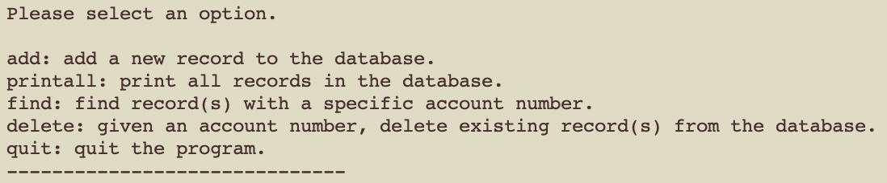

When I took ICS 212, we were given the assignment to build an application which allowed users to access a database and add or delete information, depending on user input. The assignment was split into two part: Project 1, which was written in C, and Project 2, which was the same program but written in C++. The concept was kept the same between the two projects, where users would be able to create new records, each with distinct account number, name, and address, or delete records. 

Project 1 utilized a combination of pointers and structures to store the data of each individual record, while allowing users to add or delete records with malloc() and free(). Project 2 on the other had utilized classes and class members alongside struct, and used 'new' and 'delete' instead of malloc() and free(). Both projects made use of file pointers in order to open, read, and write to a seperate text file, which stored all records and any updates made to the list. Below is an example of code from Project1:

<pre>
  if (current != NULL && current->accountno == uaccountno) { 
         printf("----- This Account # has already been taken, Try Again -----\n"); 
         returnVal = -1;
    }
    else 
    {
        temp = (struct record *)malloc(sizeof(struct record));

        temp->accountno = uaccountno;
        strncpy(temp->name, uname, sizeof(temp->name) - 1);
        temp->name[sizeof(temp->name) - 1] = '\0';
        strncpy(temp->address, uaddress, sizeof(temp->address) - 1);
        temp->address[sizeof(temp->address) - 1] = '\0';
</pre>

I found the project to one of the most challenging aspects of the course, since I found programming with C and especially C++ to be disagreeable. However, I won't deny that I appreciated the challenge, in that fact that it pushed my capabilities with the programming languages, and allowed me to demonstrate my understanding of the course content.

 
Source: <a href="https://github.com/E-Penullar/Data-Archive-Project">E-Penullar/Data-Archive-Project</a>
