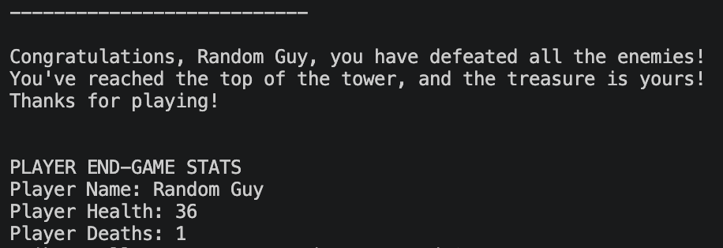

This simple project was one of the first I started working on when I got into coding; it's a bit unpolished but I'm still proud of it. The game is coded entirely in Python, which was one of the first coding languages I've learned. I made this a long time ago, so I'm thankful that I kept a copy of it, back when I still used Replit for my projects. Below is some code for the attack and heal action from the game:

<pre>
  def atk_or_hp(choice):
  if choice == "attack":
    print("You attacked the " + current_enemy[0] + ".")
    attack = random.randint(1, 5)
    print("You did " + str(attack) + " damage.")
    current_enemy[1] = current_enemy[1] - attack

    if current_enemy[1] > 0:
      return current_enemy[1]
    elif current_enemy[1] <= 0:
      return current_enemy[1]

  elif choice == "heal":
    print("You healed yourself.")
    heal = random.randint(5,10)
    print("You healed " + str(heal) + " health.")
    current_player[1] = min((current_player)[1] + heal, 50)
    print("You have " + str(current_player[1]) + " health.")
    print("")
    return current_player[1]
</pre>

It is a text-based, turn-based game in which the player goes on a quest to climb a tower, defeat some enemies, and earn a treasure at the peak. There are currently 3 difficulties: Easy, Medium, and Hard — I'm still in the process of working out a 4th difficulty for 'Unlimited', but it's been a while since I've initially worked on this. The amount of enemies the player has to fight to reach the top of the tower depends on the difficulty, 3 for Easy, 5 for Medium and 10 for Hard. The gameplay itself it's much, as the only actions the player can take is to attack the enemy or heal their health. However, if the player does end up dying during their run, they are given the choice to revive and restart from when they perished. The game ends if the player decides to not revive or if they've reach the peak; the are end-game stats given, such as how much health the player ended with and how many deaths they had. 

There are some things I plan on changing at a later date, like that 4th difficulty and perhaps new variations in enemy and player actions. While Python was easier to code with, with what I know now, I'd like to perhaps rewrite the code in Java or C, which would probably allow for better memory allocation and control over I/O.

Source: <a href="https://github.com/E-Penullar/Text-Based-Turn-Based-Game"><i class="large github icon "></i>E-Penullar/Text-Based-Turn-Based-Game</a>
